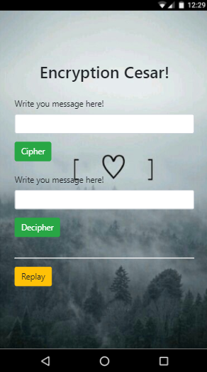
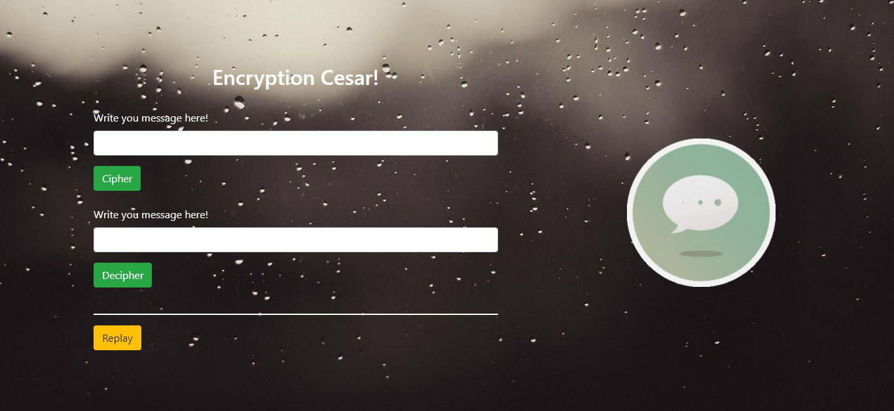

# Cifrado y Descifrado Cesar ES6
_________________________________________________

## Convirtiendo javascript 5 a ES6...

* En la siguiente pagina web el usuario podra escribir texto en los inputs, y estos regresaran el texto convertido en codigo ascii.

## **Version Mobile:**

## **Version Desktop:**

